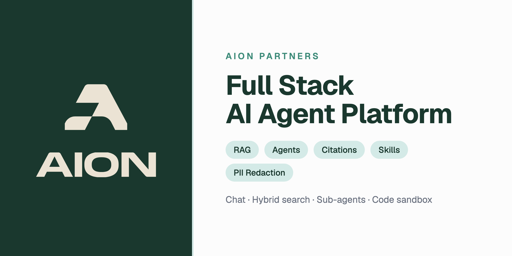

# Full Stack AI Agent Platform

A Full Stack AI Agent Platform built collaboratively with Claude Code. This project is actively developed and expanded by [AION Partners](https://aionpartners.eu).

## What This Is

A reference implementation and foundation for building AI agent systems with AI coding tools. It has grown from a RAG proof-of-concept into a full-featured AI agent platform you can fork, customize, and extend.

> **New here?** See [START-HERE.md](./START-HERE.md) to choose your path — use the app as-is, fork and extend, or build from scratch using our planning docs.

## Features

**Core:**
- Chat interface with streaming, tool calls, sub-agent reasoning, and a thinking/reasoning view
- Streamed responses survive navigation — switch threads or pages mid-generation without losing the answer
- Per-conversation model and reasoning-effort selection
- Image attachments — paste or upload images straight into a message
- Document ingestion with drag-and-drop, real-time status, staged progress, and one-click retry of failed documents
- Full RAG pipeline: smart chunking, embedding (pgvector), hybrid search, reranking
- Record manager with content hashing and deduplication
- LLM-powered structured metadata extraction
- Multi-format support: PDF, DOCX, PPTX, XLSX, HTML, Markdown, images (via Docling)

**Citations:**
- Verbatim, quote-based inline citations with hover previews and a source panel
- Click-through highlighting in the original source — PDF pages, rendered Markdown (including tables), and plain text
- Web-search citations that snapshot the cited page

**Agentic Features:**
- Web search fallback
- Sub-agents with isolated context
- Deep agent mode with plan and workspace panels
- Knowledge Base Explorer with folder hierarchy
- KB Tools: `ls`, `tree`, `grep`, `glob`, `read`, plus document structure/section navigation
- Explorer sub-agent for multi-tool research

**Documents & workspace:**
- Rendered document sidecar with PDF/DOCX preview and inline image rendering
- Bulk document actions (multi-select delete + move) and folder organization

**Advanced:**
- ChatGPT / Codex subscription inference — route primary and sub-agent calls through your ChatGPT plan (`LLM_PROVIDER=codex`)
- Thread context compaction — a summary-buffer hybrid pipeline keeps long conversations within the context window
- PII Redaction via Microsoft Presidio (realistic surrogates, reversible anonymization)
- Skills system — reusable behaviors with linked document folders, importable from a remote URL (skills.sh / GitHub)
- Code Sandbox (Docker-based Python execution with file generation)
- Unified Tool Registry with dynamic discovery via the `tool_search` meta-tool
- Sandbox HTTP Bridge — LLM-generated code calls platform tools programmatically (Code Mode)
- MCP Client — connect external tool servers (GitHub, etc.) via Model Context Protocol
- Context Window Usage Indicator — token usage progress bar with color thresholds
- Interleaved chat history — sub-agent panels and code execution persist across reloads
- Responsive layout (desktop + mobile) with a collapsible sidebar
- Thread sidebar with search, lazy loading, and inline rename
- Dark mode with LLM-powered thread naming

## Tech Stack

| Layer | Tech |
|-------|------|
| Frontend | React, TypeScript, Vite, Tailwind, shadcn/ui |
| Backend | Python, FastAPI |
| Database | Supabase (Postgres + pgvector + Auth + Storage + Realtime) |
| Tool Protocol | MCP (Model Context Protocol) |
| Doc Processing | Docling |
| PII Redaction | Microsoft Presidio, spaCy, Faker |
| AI Models | OpenAI, OpenRouter, Ollama, LM Studio (any OpenAI-compatible), ChatGPT/Codex subscription |
| Observability | LangSmith, Langfuse (optional) |

## Prerequisites

- Python 3.11 – 3.13 (3.14 may require dependency updates)
- Node.js 18+
- Docker Desktop (for local Supabase and/or code sandbox)
- [uv](https://docs.astral.sh/uv/) (recommended for fast Python dependency installs)
- Ollama or LM Studio for local LLMs (optional)

## Get Started

> **Follow [INSTALL.md](./INSTALL.md) for detailed step-by-step setup instructions**, including Supabase configuration, environment variables, and database migrations.

## Other Docs

- [START-HERE.md](./START-HERE.md) — Choose your path
- [CLAUDE.md](./CLAUDE.md) — Context for Claude Code

## About

Built and maintained by [AION Partners](https://aionpartners.eu).

Fork it. Break it. Build something amazing.

---
